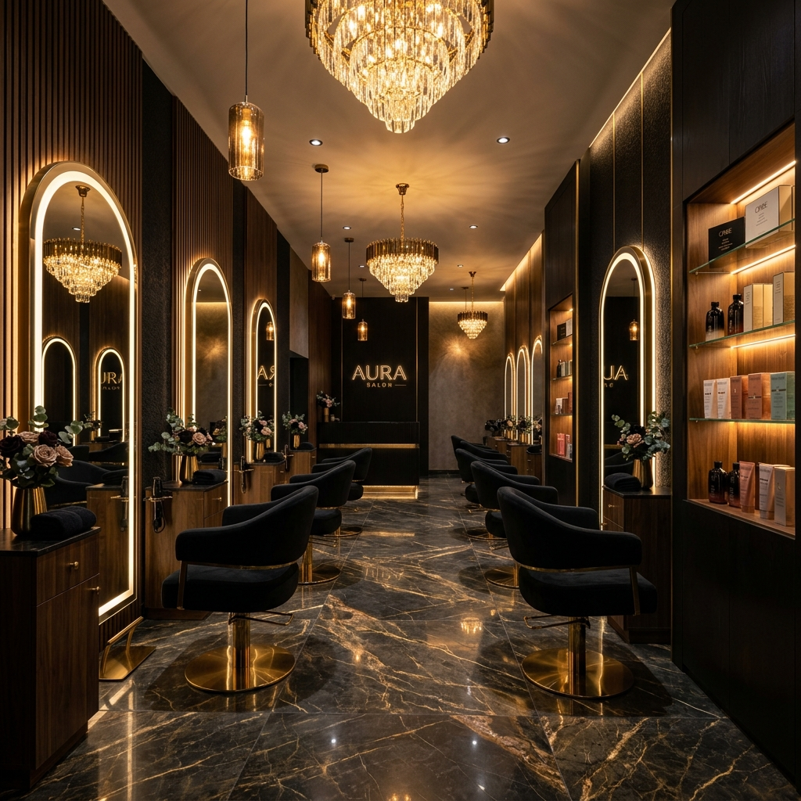

# AURUM Luxury Salon & Spa

A state-of-the-art, premium Single-Page Application (SPA) designed to serve as the elite digital storefront and booking engine for a luxury salon and spa. Built entirely with Vanilla web technologies to prioritize rapid loading, uncompromising visual performance, and absolute creative control.

## Features

- 🌌 **"Dark Luxury" Aesthetic**: High-contrast, meticulously balanced golden layout paired with sleek glassmorphism effects.
- 🎨 **Immersive Custom Cursor**: Dual-element floating cursor system that dynamically intersects and blends with UI components.
- 💫 **3D & Scroll Animations**: Features parallax backgrounds, floating particles, CSS3 depth tilt effects, and seamlessly orchestrated **GSAP ScrollTrigger** staggered entrance elements.
- 📅 **Dynamic Booking Framework**: A robust 5-step local-storage booking wizard. Includes service-to-cart toggling, artist selection, and a simulated schedule calendar with automated phone number formatting logic.
- 🛎️ **Local Notification Engine**: Simulates push-notification background reminders via the `Notification API` for upcoming cached appointments.
- 📸 **Gallery Lightbox**: Expandable portfolio grid.
- ✨ **AURUM Elite**: Tier-based membership grid.

## Tech Stack

*   **HTML5 / Semantic DOM**
*   **CSS3** (Custom Properties, Grid, Flexbox, Perspective Rotations, Filters)
*   **Vanilla JavaScript (ES6)**
*   [GSAP 3](https://greensock.com/gsap/) + ScrollTrigger for high-performance scroll interpolation.

## Local Setup

Since this application utilizes ES6 modules and modern APIs, it must be accessed via a local web server (loading directly from `file://` may cause CORS or module issues).

### Using Python
If you have Python installed, navigate to the project directory and run:
`python -m http.server 3000`
Then open `http://localhost:3000` in your web browser.

### Using Node.js (npx)
If you have Node installed, you can use:
`npx serve .`

## Future Backend Integration Map

Currently, `js/booking.js` serves and modifies data via the browser's `localStorage` and arrays. This acts as a decoupled UI client. To pivot to a live production database:
1. Strip the `localStorage.setItem` blocks inside the `confirmBooking()` function.
2. Create an asynchronous `fetch()` POST endpoint targeting a secure API logic handler (Node/Express, Python FastAPI, etc.).
3. Replace the background timer set in `reminders.js` with a dedicated job scheduler on the server matching the new backend schema.

---
*Created as a prototype benchmark in Premium Web UX Architecture.*
